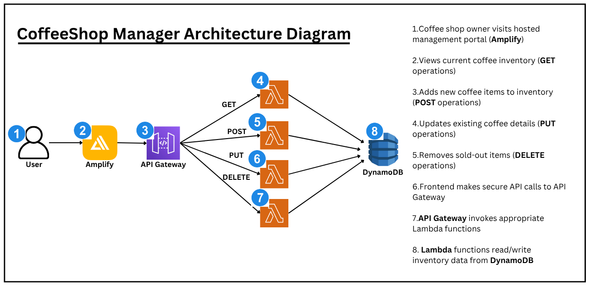
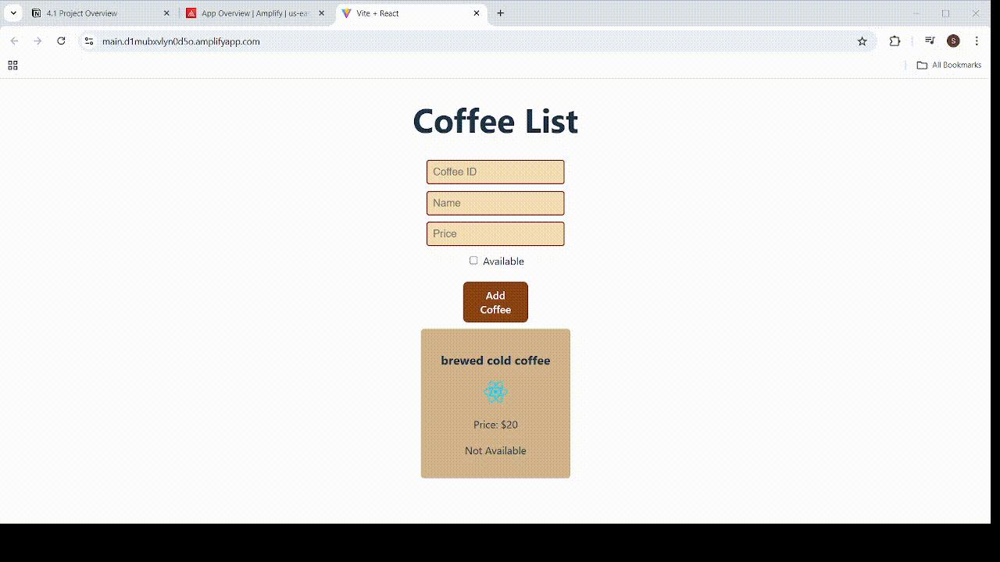

# ☕ Serverless Inventory Management on AWS (Performance Efficiency Pillar)

CoffeeShop Manager is a fully serverless backend for managing coffee shop inventory.  
Instead of relying on traditional always‑on servers that require scaling, maintenance, and infrastructure overhead, this project uses AWS serverless services to deliver a highly scalable, cost‑efficient, and resilient system.

This architecture is built following the **Performance Efficiency Pillar** of the AWS Well‑Architected Framework.

---

## ☁️ Project Overview

## 🏗 Architectural Diagram

```html


### 📘 Scenario  
CoffeeShop Manager allows coffee shop owners to manage their inventory through a fully serverless backend.  
Using API Gateway, Lambda, DynamoDB, IAM, and CloudWatch, the system provides:

- Serverless compute  
- Efficient, pay‑per‑use pricing  
- Smooth scaling under traffic spikes  
- Minimal operational overhead  
- A fully functional React frontend hosted on AWS Amplify  

---

## 👨‍💻 Your Role  
As a Solutions Architect, your goals were to design and deploy an architecture that is:

- Easy to maintain  
- Event-driven  
- Serverless-first  
- Secure and fully monitored  
- Cost-effective  
- Frontend-ready  

You built the backend logic, API layers, and frontend integration for a complete inventory management experience.

---

## 📚 What You’ll Learn

- Designing REST APIs with **API Gateway + Lambda**
- Storing data in **DynamoDB** with best practices
- Building **Lambda Layers** for reusable dependencies
- Implementing secure **IAM roles and policies**
- Building **CRUD** operations for inventory management
- Enabling **CORS** for frontend access
- Using **CloudWatch** for monitoring & observability
- Deploying a **React** frontend on AWS Amplify
- Integrating frontend applications with serverless backends

---

## 🛒 What the System Does

1. Coffee shop owner logs into the Amplify-hosted frontend  
2. Views existing inventory (GET)  
3. Adds new items (POST)  
4. Updates items (PUT)  
5. Deletes items (DELETE)  
6. API Gateway routes requests  
7. Lambda processes logic  
8. DynamoDB stores data  

---

## 🛠 Services Used

- **Amazon DynamoDB** – Inventory database  
- **AWS Lambda** – Backend compute  
- **Lambda Layers** – Shared code  
- **API Gateway** – REST API  
- **IAM** – Secure roles & policies  
- **CloudWatch** – Logs & monitoring  
- **AWS Amplify** – Frontend hosting  
- **React.js** – UI framework  

---

## ⏳ Estimated Time & Cost

- Time: **3–4 hours**  
- Cost: **$0.10–$0.50** (almost entirely free tier)

---


```html
